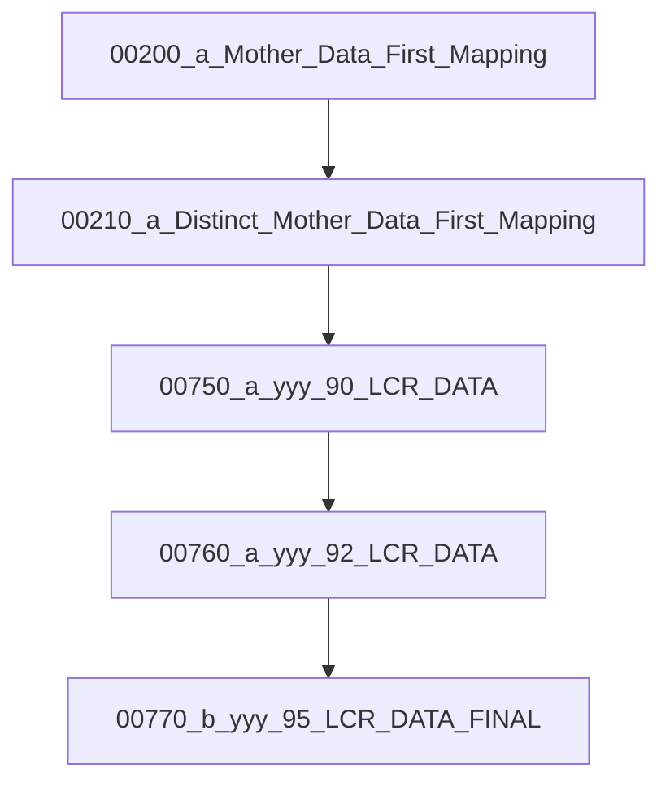

# 📑 GBI: Liquidity - LCR

Description of Inputs, transformations and outputs of LCR

---

## 🔎 Dataflow Analysis (Inputs → Temps → Final)


### 1. Inputs (raw sources)
- `00200_b_Mother_Data_First_Mapping`
- `00750_k01_Manual_Input_From_Jean_Paul`
- `00770_a_yyy_95_LCR_DATA_FINAL` *(legacy/manual final?)*
- `b001_Manual_Input_From_Jean_Paul`
- `yyy_30_BBVA_Financial_Statement`

### 2. Transform / Temporary (wrk/staging)
- `yy_10_a_Mother_Data_First_Mapping`
- `yy_10_b_Distinct_Mother_Data_First_Mapping`
- `yyy_30_BBVA_Financial_Statement_Additional`
- `yyy_90_LCR_DATA`

### 3. Final Deliverable
- `yyy_95_LCR_DATA_FINAL`

---

## 📋 Macro 1_SIL (Simplified Pipeline)

File: `Macro1_SIL.mac`


---

## 📊 Summary
``` LCR_Macro_1 ```
