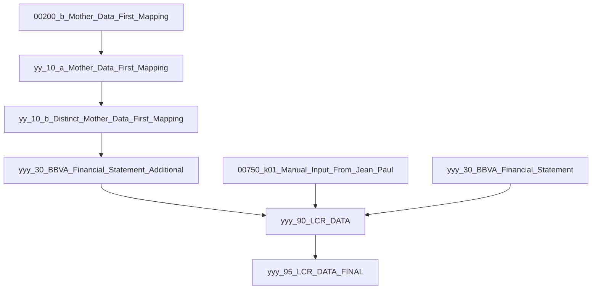
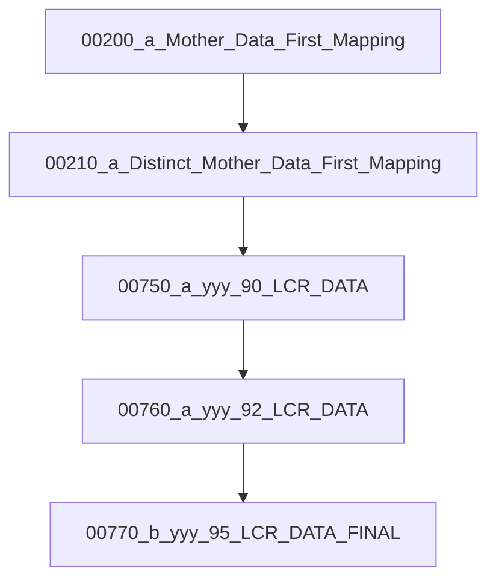

# 📑 GBI: Liquidity - LCR

Description of Inputs, transformations and outputs of LCR

---

## 🔎 Dataflow Analysis (Inputs → Temps → Final)

From `objects.csv` and `dependencies.csv`, the migration process can be broken down into three main stages:

### 1. Inputs (raw sources)
- `00200_b_Mother_Data_First_Mapping`
- `00750_k01_Manual_Input_From_Jean_Paul`
- `00770_a_yyy_95_LCR_DATA_FINAL` *(legacy/manual final?)*
- `b001_Manual_Input_From_Jean_Paul`
- `yyy_30_BBVA_Financial_Statement`

### 2. Transform / Temporary (wrk/staging)
- `yy_10_a_Mother_Data_First_Mapping`
- `yy_10_b_Distinct_Mother_Data_First_Mapping`
- `yyy_30_BBVA_Financial_Statement_Additional`
- `yyy_90_LCR_DATA`

### 3. Final Deliverable
- `yyy_95_LCR_DATA_FINAL`

---

## 🔀 Example Dependency Chains



📌 This matches the intended **Access → SQL Server pipeline**:  
**Inputs → Transform Stages → Final Report**

---

## 📋 Macro 1 (Main Pipeline)

File: 'Macro1.mac'

```mermaid
flowchart TD
    M1[00100_a_Overwrite_Keys] --> M2[00110_a_Update_Lookup_First_Mapping]
    M2 --> M3[00200_a_Mother_Data_First_Mapping]
    M3 --> M4[00200_c_Mother_Data_First_Mapping]
    M4 --> M5[00210_a_Distinct_Mother_Data_First_Mapping]
    M5 --> M6[00210_b_Distinct_Mother_Data_First_Mapping]
    M6 --> M7[RunCode C_primary()]
    M7 --> M8[00210_c_First_Mapping_DATA_UPDATE]
    M8 --> M9[00750_a_yyy_90_LCR_DATA]
    M9 --> M10[00750_b_yyy_90_LCR_DATA]
    M10 --> M11[00750_c_yyy_90_LCR_DATA_Totals]
    M11 --> M12[00750_k02_Manual_Input_From_Jean_Paul]
    M12 --> M13[00760_a_yyy_92_LCR_DATA]
    M13 --> M14[00760_b_yyy_92_LCR_DATA]
    M14 --> M15[00760_c_yyy_92_LCR_DATA_Update_Nulls]
    M15 --> M16[00760_d_yyy_90_LCR_DATA_Update_Is_Zero]
    M16 --> M17[00770_b_yyy_95_LCR_DATA_FINAL]
    M17 --> M18[00770_c_yyy_95_LCR_DATA_FINAL]
    M18 --> M19[00770_d_Total_Amount_Update]
    M19 --> M20[00770_e_Breakdown_Amount_Update]
    M20 --> M21[RunCode C_Breakdown_No()]
    M21 --> M22[00780_a_yyy_95_LCR_DATA_FINAL_Len_concatenar]
```

✅ **Macro1 = Full build** (all stages, manual inputs, updates, breakdowns).

---

## 📋 Macro 1_SIL (Simplified Pipeline)

File: `Macro1_SIL.mac`



✅ **Macro1_SIL = Lite build** (skips many enrichment/cleanup steps).  
Useful for faster rebuilds or testing.

---

## 📊 Summary

- **Macro1:** Full pipeline (production build).
- **Macro1_SIL:** Simplified pipeline (testing / faster run).
- **Final output:** `yyy_95_LCR_DATA_FINAL`.
- **Migration flow:** Access queries/macros → SQL Server ETL → Final reports.
